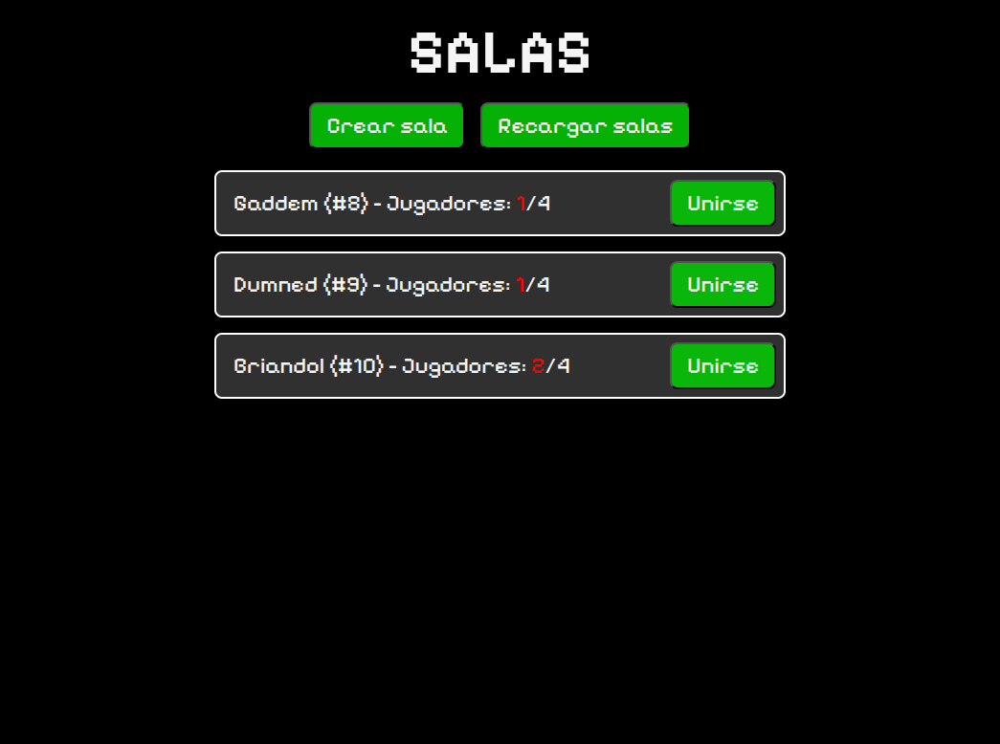
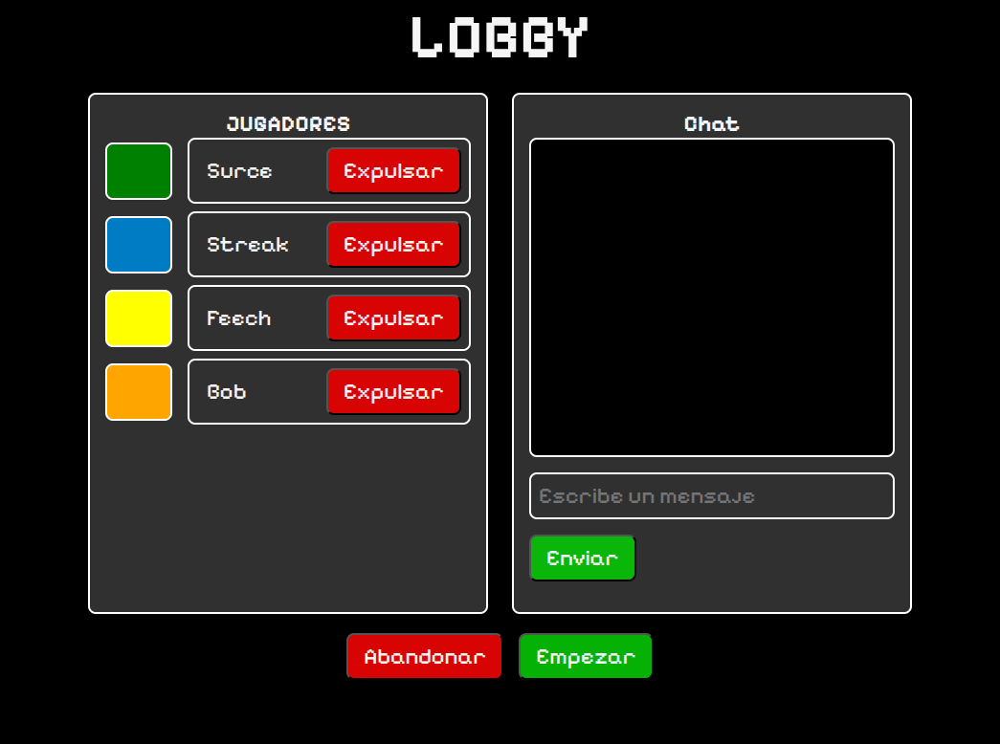

# TankWars 🎮

A real-time multiplayer tank battle game played in the browser. Players control tanks in a shared arena, shoot bullets, collect power-ups, and fight until only one remains.

Built with a **Python/FastAPI** backend (authoritative game server with custom physics) and a **React + PixiJS** frontend (smooth client-side rendering with interpolation).

## Tech Stack

| Layer | Technology |
|---|---|
| Backend | Python 3.12, FastAPI 0.115, Uvicorn |
| Physics | Custom engine with Numba JIT acceleration |
| Database | SQLite via Pony ORM |
| Frontend | JavaScript, React 19, Vite 6 |
| Rendering | PixiJS 8.6 (WebGL/Canvas 2D) |
| Real-time | WebSockets (server-authoritative state sync) |

## Features

- Real-time multiplayer — join or create lobbies with up to 4 players
- Mouse-aimed tank controls (tank follows cursor, click to shoot)
- Server-authoritative physics with client-side interpolation for smooth gameplay
- Custom collision engine (bullet-tank, bullet-wall bounce, bullet-bullet, buff-tank)
- Power-up buffs: **Health** (restore HP) and **Cooldown** (faster shooting)
- In-game chat
- 3-second countdown before matches
- Game over screen with winner announcement

## Project Structure

```
TankWars/
├── backend/            # Python FastAPI server
│   ├── api/            # API routes & WebSocket handling
│   ├── db/             # Database models & services (SQLite + Pony ORM)
│   └── src/            # Core game logic & physics engine
│
├── frontend/           # React + Vite + PixiJS client
│   ├── public/         # Static assets (tank sprites, tiles, buff animations)
│   ├── src/            # React components, game rendering, entity management
│   └── .env.development
│
└── img/                # Screenshots
```

## How to Run Locally

### Backend

```bash
cd backend
python -m venv .venv
source .venv/bin/activate
pip install -r requirements.txt
uvicorn api.api:app --reload --host 0.0.0.0 --port 8000
```

Or use the provided script:

```bash
cd backend && bash run.sh
```

### Frontend

```bash
cd frontend
npm install
npm run dev
```

This starts the Vite dev server at `http://localhost:5173`.

### Production Build

```bash
cd frontend
npm run build    # vite build --mode production
npm run preview  # preview the production build
```

### Environment Variables

The frontend expects these in `.env.development`:

```
VITE_API_URL=http://localhost:8000
VITE_WS_URL=ws://localhost:8000
VITE_BASE_URL=/
VITE_ROUTER_BASENAME=/
```

The backend's database file is set via the `ENVIRONMENT` env var (defaults to `TEST`, producing `database_test.sqlite`).

## How to Play

1. Open `http://localhost:5173` and enter your name
2. Create a new room or join an existing one
3. In the lobby, wait for the owner to start the game
4. **Move** your mouse to aim/steer the tank
5. **Click** to shoot bullets
6. Collect **green** health buffs to restore HP and **yellow** cooldown buffs to shoot faster
7. Last tank standing wins!

## Architecture Overview

- **Server-authoritative**: All game state and physics simulation runs on the server. The client sends only inputs (mouse position, shoot commands) and renders the state it receives.
- **Client-side interpolation**: The client buffers incoming snapshots and interpolates between them using a moving median filter, providing smooth visuals despite network jitter.
- **State machine**: Games progress through states — `Lobby` → `PrevGameConfig` → `Countdown` → `InGame` → `GameOver` → back to `Lobby`.
- **Numba physics**: Collision detection and response are JIT-compiled with Numba for performance. Supports circle-circle (bullet-bullet, bullet-tank) and circle-rect (bullet-wall) collisions with bounce behavior.

## Screenshots

| Room browser | Lobby | In-game |
|---|---|---|
|  |  | .png) |

## TODO

Development is currently stopped with no real plans of finishing anytime soon. Some of the features remaining of implementation include:

- Automatic lobby redirection when game ends.
- Route protection so only members of a game can have access to it.
- General user authentication mechanisms (sessions, jwt, etc.)
- General gameplay improvements.
